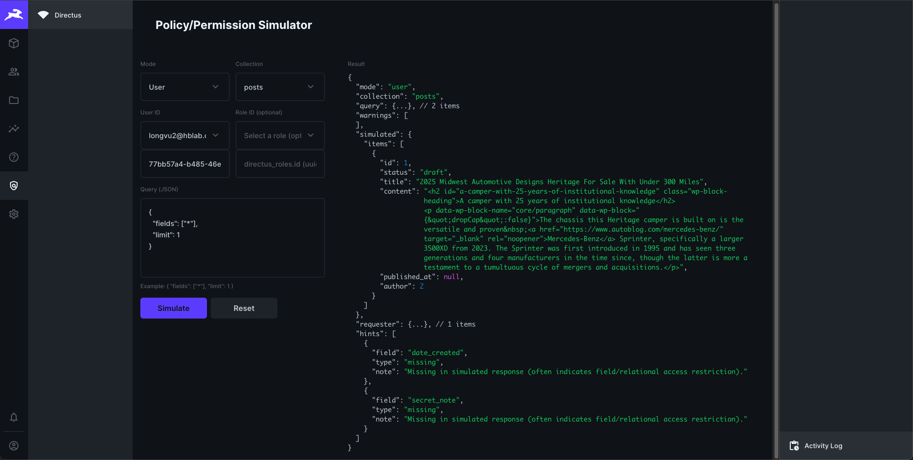

# Policy/Permission Simulator (Directus Extension)

## What it does
This project adds a small “Policy/Permission Simulator” to Directus: a Studio module UI plus a backend endpoint that lets an admin simulate item reads under different permission contexts (requester, specific user, role, or public), and shows the simulated result (with warnings and optional comparison hints).

## Why it’s useful
Directus permissions can be hard to reason about—especially with field-level restrictions and user-dependent rules. This simulator helps you quickly answer “what would this user/role/public see for this collection + query?” without needing to log in as multiple accounts or guess why certain fields are missing.

## How to install/use it
### Prerequisites
- Docker + Docker Compose

### Run Directus with the extensions
1. From the repo root, start Directus:
   - `docker compose up -d`
2. Open Directus Studio:
   - http://localhost:8055/admin

### Create sample data (posts + User role)
The simulator is most useful when you have a collection + role permissions to test. Here’s a minimal setup.

#### 1) Create collection `posts`
In Directus Studio:

1. Go to **Settings → Data Model**
2. **Create Collection** → name: `posts`
3. Add fields (suggested minimal fields):
   - `title` (Type: String)
   - `content` (Type: Text)
   - `status` (Type: String)
   - `secret_note` (Type: Text) — this is the “restricted field” we’ll hide from non-admins

#### 2) Create role `User`
1. Go to **Settings → Roles & Permissions**
2. **Create Role** → name: `User`

#### 3) Configure permissions for role `User`
In **Settings → Access Policies**:
Create policy "Read post limited" with read access to `posts` collection without `secret_note` field.

#### 4) Create a test user assigned to role `User`
1. Go to **User Directory → Create User**
2. Assign Role: `User`
3. Ensure Status: `active`
4. Create a few `posts` items (include values for `secret_note` so you can see it disappear under simulation).

### Use the simulator in Studio
1. Log in with an admin account.
2. Open the module:
   - http://localhost:8055/admin/policy-permission-simulator
   - (Optional) Pin it in the navigation sidebar.
3. Choose:
   - **Mode**: `requester` / `user` / `role` / `public`
   - **Collection**: the collection to simulate against
   - **User / Role** (if applicable)
   - **Query (JSON)**: an ItemsService-style query (e.g. `{ "fields": ["*"], "limit": 1 }`)
4. Click **Simulate**.

### Notes
- The API endpoint is admin-only (it relies on the caller being admin to perform controlled simulations).
- If a simulated context cannot access some queried fields, the endpoint will retry once (when possible) with the forbidden fields removed from `query.fields`, and returns a warning describing what was removed.

## API Endpoint (extension)
The backend extension is an endpoint mounted at `/policy-simulator-be`.

### Routes
- `GET /policy-simulator-be/`
   - Health/status payload
- `POST /policy-simulator-be/simulate`
   - Runs an ItemsService read under a simulated accountability context
   - Admin-only (returns 403 if the caller is not admin)

### Request body
```json
{
   "mode": "requester | user | role | public",
   "collection": "posts",
   "query": { "fields": ["*"], "limit": 1 },
   "includeRequester": true,
   "userId": "<uuid>",
   "roleId": "<uuid>"
}
```

### Behavior notes
- `mode=requester`: uses the caller’s accountability (no simulation)
- `mode=user`: simulates as a specific user (and resolves role if not provided)
- `mode=role`: simulates as a role only (approximation; cannot evaluate `$CURRENT_USER` dependent rules)
- `mode=public`: simulates an unauthenticated/public context
- If the simulated context cannot access one or more queried fields, the endpoint will try **one retry** by removing those forbidden fields from `query.fields` (and may remove `"*"` if present alongside explicit fields).

### Response (shape)
```json
{
   "mode": "user",
   "collection": "posts",
   "query": { "fields": ["title"], "limit": 1 },
   "warnings": [],
   "simulated": { "items": [/* ... */] },
   "requester": { "items": [/* ... */] },
   "hints": [
      { "field": "secret_note", "type": "missing", "note": "..." }
   ]
}
```

## Screenshot

